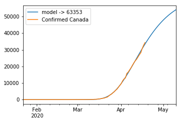
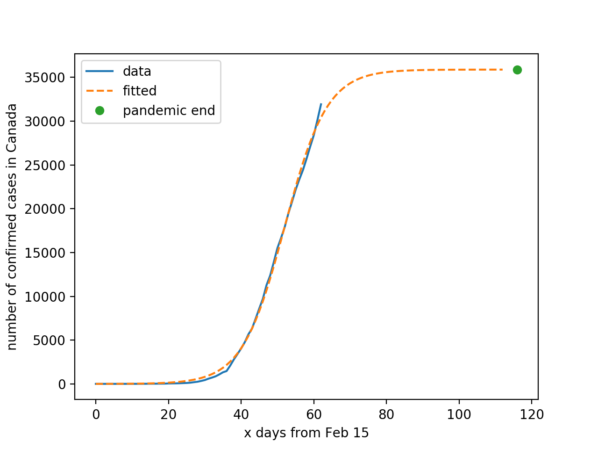

<html><head><meta content="text/html; charset=UTF-8" http-equiv="content-type"></head><body class="c14">
Idea&nbsp;

Our idea is that the number of people who have participated in spreading awareness about social distancing on social media is an influence on the spread of COVID-19 in Canada and can help us predict future cases more accurately.

Methodology

To assess the current situation of COVID-19 in Canada, we obtained the number of total cases per day. The machine learning model to predict our initial guesses was directly taken from Kaggle, and then adjusted to fit our time series.

Here&rsquo;s the initial prediction graph.

There are two details on this model that caught our eye: 

1) This model underestimated on certain days (April 5th) and overestimated on some others (April 15th). 

2) This model predicted that the pandemic would be over on October 27, 2020.

One of the covariants which this model did not account for is people&rsquo;s tendency to follow the government&rsquo;s recommendation to stay home and isolate.

In order to measure how people are responding to these social guidelines, we analyzed over 10 Million&nbsp;tweets sent since the first day of March. We used two Twitter datasets which in union contain every tweet related to COVID-19 from March 1st to April 19th and the number of tweets reached close to 180 million tweets. We then iterated over these tweets to extract and rank the top 1000 most frequent bigrams on each day. These bigrams exclude stopwords such as &ldquo;at, the, in etc&rdquo;. For the purpose of testing our hypothesis we kept track of bigrams that are precisely tied to social distancing, such as &ldquo;stay home&rdquo;, &ldquo;herd immunity&rdquo;, &ldquo;sign petition&rdquo; and &ldquo;contact tracing&rdquo;.

Lastly, we engineered a formula to calculate the influence of the rankings of these bigrams. Applying the formula to the predictions resulted in an adjusted prediction model, which we believe is more accurate for&nbsp;estimating how many people will be infected in the near future, such as next 7 days.

Implementation

&nbsp;We obtained the number of total cases per day in Canada from Kaggle. There were two<a href="#cmnt1" id="cmnt_ref1">[a]</a>&nbsp;models we considered using to make predictions for the upcoming days. First, we considered logistic curve fitting. This is simply a statistical method to fit a logistic curve over the number of confirmed cases time series. After fitting the curve, we found that the results were grossly underestimated and were not happy with the results. 

&nbsp;&nbsp;&nbsp;&nbsp;&nbsp;&nbsp;&nbsp;&nbsp;So, we started looking for other models, and came across a model that was based on a different model that used to predict diffusion of innovations. This original model is from a marketing paper by Emmanuelle Le Nagard and Alexandre Steyer, that attempts to reflect the social structure of a diffusion process. While this model was not used to predict a pandemic outcome, the author of this model believed that there are commonalities in both domains. So we used the result of this new model to predict the next week and find when the pandemic will end. This model finds the optimal function parameters using scipy optimize and Nelder-Mead algorithm.

As previously mentioned, we used a combination of two Twitter datasets. These datasets captured tweets that contain keywords such as &ldquo;coronavirus&rdquo;, &ldquo;2019nCoV&rdquo;, or hashtags such as &ldquo;#covid19&rdquo;, &ldquo;#coronavirus&rdquo;. The first dataset obtained from Kaggle contained a column with the plain text of the tweet. We were able to pull this data into the Data Science servers of the University of Waterloo, which is a distributed systems cluster. We put the large file in Hadoop File System, and ran an Apache Spark application to compute the top bigrams per day in a parallel fashion. We then removed the most common English stop words&nbsp;from our top bigrams to finalize our list of top bigrams. However, the Kaggle dataset contained tweets from March 4th to March 28th. This led us to gather additional data from <a class="c8" href="https://www.google.com/url?q=https://github.com/thepanacealab/covid19_twitter/blob/master/www.panacealab.org&amp;sa=D&amp;ust=1587439427202000">Panacea Lab</a>s, which contained tweets from March 12th&nbsp;to April 19th. Moreover, this dataset had already processed the top bigrams per day.

To adjust the predictions based on our data analysis, we came up with the following.

def calc_multiplier(ranking):

&nbsp; &nbsp; # Ranking from 10 days ago

&nbsp; &nbsp; return (1001 - ranking) &nbsp;/ 100000

Mutliplier = 1 - a*calc_multiplier(sign petition) - b*calc_multiplier(stay home)

+ c*calc_multiplier(herd immunity) - d*calc_mutliplier(contact tracing)

The formula to calculate the new prediction is:

New_pred = old_pred * multiplier

This formula calculates the multiplier given a rank of a bigram. For example, if the bigram&rsquo;s rank is 1, then our formula would calculate to 0.01 (ie. 1%). This multiplier is then used to adjust our predictions.

It is important to note that we use the rankings 10 days before the day we are predicting. For example, if we are predicting for April 11th, then we would be using rankings from April 1st. We calculated this number from adding 5 to 6 days of incubation period to the 3 to 4 days for a test result to be confirmed as positive.

As for the multiplier equation; if a &ldquo;negative&rdquo; bigram yields a 1% multiplier, then we would add this multiplier and end up with a 1% increase towards our prediction. If a &ldquo;positive&rdquo; bigram yields a 1% multiplier, then we would subtract this multiplier and end up with a 1% decrease towards our prediction. This is because we think that &ldquo;positive&rdquo; bigrams are a major factor in spreading awareness, which then affects the spread of COVID 19. Thus, lowering the predicted number of cases. And vice versa for &ldquo;negative&rdquo; bigrams.

Results

We added the parameters a,b,c,d because we found that high ranking bigrams, such as &ldquo;stay home&rdquo;, had too much of an influence that all the other bigrams did not matter. To find the optimal parameters, we tried all permutations from values 1 to 5. The most optimal parameter values are: a = 1, b = 1, c = 5. d = 4. Values a = 1, b = 1, c = 5, d = 5 also had the same results. These values adjusted the predictions so that it was closer to the actual number of cases by 50%. The more accurate values are highlighted in yellow. Once we found these values, we used this to adjust our predictions for the following week.

For our pandemic end date prediction, we apply the same adjustments, with the multipliers scaled by 10 and the multiplier is based on the average of rankings. This is due to not being able to apply the 10 days incubation period since the pandemic end date is ambiguous.

Because we maximized the parameters (a,b,c,d) to fit the given data as much as possible, we fear that we are overfitting our model. One way we could solve this issue is to choose a less accurate set of parameters so that our adjustments are more generalized.

&nbsp;&nbsp;&nbsp;&nbsp;&nbsp;&nbsp;&nbsp;&nbsp;

Prediction

Based on our model, we predict that this pandemic will last 267 days from January 22nd, which is Tuesday October 15, 2020, with a total of 63353 cases. For the bonus part of this project, we predict there will be 5716&nbsp;new cases of COVID-19 in Canada in the first week of May (1-7 inclusive), 9794&nbsp;new cases in the first two weeks of May (1-14 inclusive), and&nbsp;16125&nbsp;in the month of May (1-31 inclusive).

By the time you are watching this video, we are no longer undergrad students. So professor, if you need a hand in research or something, feel free to let us know. Thanks for watching our video. Please smash that like button and subscribe to our channel.

Links

Github: <a class="c8" href="https://www.google.com/url?q=https://github.com/thepanacealab/covid19_twitter&amp;sa=D&amp;ust=1587439427208000">https://github.com/thepanacealab/covid19_twitter</a>

Kaggle: <a class="c8" href="https://www.google.com/url?q=https://www.kaggle.com/smid80/coronavirus-covid19-tweets&amp;sa=D&amp;ust=1587439427208000">https://www.kaggle.com/smid80/coronavirus-covid19-tweets</a>

English Stop Words: <a class="c8" href="https://www.google.com/url?q=https://gist.github.com/sebleier/554280&amp;sa=D&amp;ust=1587439427208000">https://gist.github.com/sebleier/554280</a>

Social distancing image source: <a class="c8" href="https://www.google.com/url?q=https://www.safetyandhealthmagazine.com/articles/19578-covid-19-pandemic-tips-to-remain-sane-and-safe-during-social-distancing&amp;sa=D&amp;ust=1587439427209000">https://www.safetyandhealthmagazine.com/articles/19578-covid-19-pandemic-tips-to-remain-sane-and-safe-during-social-distancing</a>

Hashtags image source: <a class="c8" href="https://www.google.com/url?q=https://assets.cureus.com/uploads/figure/file/102058/lightbox_5c40f7a05f5211eaa2905ba8f2f4e909-Figure1.png&amp;sa=D&amp;ust=1587439427209000">https://assets.cureus.com/uploads/figure/file/102058/lightbox_5c40f7a05f5211eaa2905ba8f2f4e909-Figure1.png</a>

Overfitting image source: http://data-mining.philippe-fournier-viger.com/some-funny-pictures-related-to-data-mining/overfitting/

Graduation Cap Throw image source:

<a class="c8" href="https://www.google.com/url?q=https://veryfunnypics.eu/to-all-you-high-school-graduates-out-there/&amp;sa=D&amp;ust=1587439427210000">https://veryfunnypics.eu/to-all-you-high-school-graduates-out-there/</a> 

Predictions

End date: Tuesday, October 15, 2020. Total case number of 63353.

First week of May: 5716 cases.

Second week of May: 9794 cases.

Month of May: 16125 cases.

<a href="#cmnt_ref1" id="cmnt1">[a]</a>Were there other options?

</body></html>